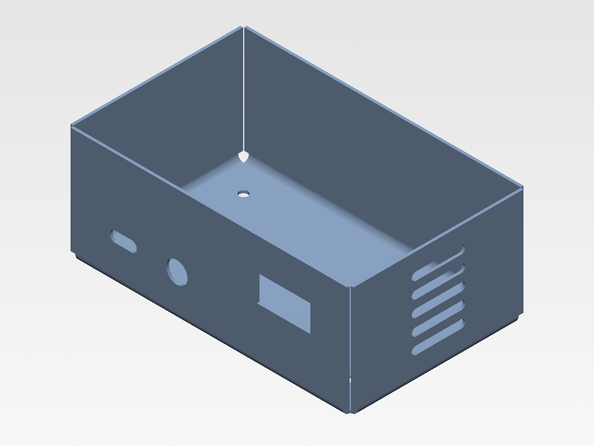
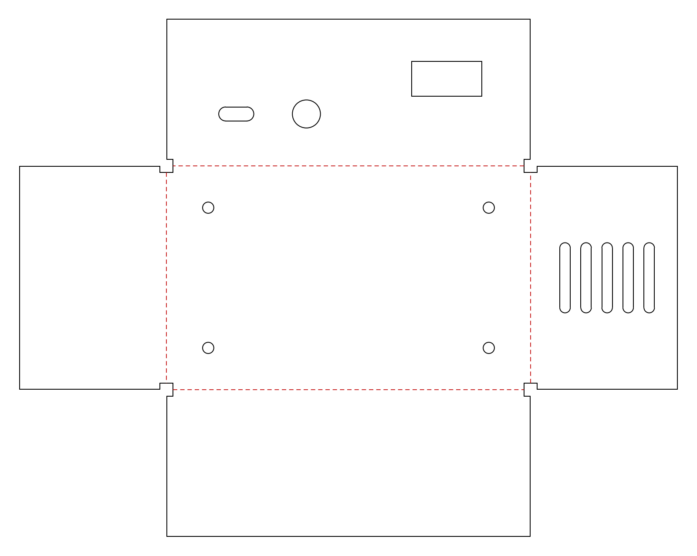

# Sheet Metal Enclosure Generator

Generates a family of bent sheet metal enclosures from a CSV table. For each
variant it writes a 3D model (STEP), a flat pattern for laser cutting (DXF),
and a manifest listing every file and its status.

## Output

For every row in the enclosure table:

- `step/<variant>.step`: the folded part, in mm.
- `dxf/<variant>.dxf`: the flat pattern, in mm. Cut contours are on layer
  `CUT`, bend lines on layer `BEND`. Each bend line is the centerline of
  its bend zone, not a tangent line. Geometry is lines, arcs and circles
  only, no splines.
- `manifest.csv` and `manifest.xlsx`: one row per variant with its
  parameters, file names and status. `features_manifest.csv` records the
  status of each feature.

## Input

**Enclosure table** (`showcase_input.csv`)

| column | meaning |
|---|---|
| `variant_id` | name used for the output files |
| `inner_length_mm`, `inner_width_mm`, `inner_height_mm` | inside dimensions of the box |
| `thickness_mm` | sheet thickness |
| `bend_radius_mm` | inside bend radius |
| `k_factor` | neutral axis position used for the bend allowance |

Dimensions are inside dimensions, so the box is sized directly from what has
to fit in it.

**Feature table** (`showcase_features.csv`): holes, slots and rectangular
cutouts on any face.

| column | meaning |
|---|---|
| `variant_id` | enclosure the feature belongs to |
| `face` | `base`, `front`, `back`, `left`, `right` |
| `type` | `hole`, `slot`, `rect` |
| `u_mm`, `v_mm` | center position (see below) |
| `size1_mm`, `size2_mm` | hole: diameter. slot: overall length, width. rect: width, height |
| `rotation_deg` | rotation of a slot or rect, in degrees, counterclockwise in the face's `u`-`v` frame; 0 = long axis horizontal |
| `count_u`, `count_v`, `pitch_u_mm`, `pitch_v_mm` | optional grid; `u`, `v` is the center of the grid |

Positions are measured on the inside surface:

- Base: from the inside front-left corner, `u` along the length, `v` along
  the width.
- Walls: viewed from outside, `u` from the wall's left inside edge, `v` up
  from the inside floor.

## Bend allowance

All bends are 90°. The flat length of each bend is

    BA = (π/2) · (R + K · T)

K is an input because it depends on the material and the press brake. The
value in the examples (0.38) is a placeholder: replace it with your
fabricator's value and regenerate.

## Validation

Before anything is built, every feature, and every instance of a grid, is
checked to lie on the flat part of its face, clear of the bends. Rotated
features are checked with their rotated extent. If any
feature of a variant fails, that variant is not generated at all and the
manifest gives the reason. A part with a missing hole is worse than no part.

## Verification

- Inside dimensions measured on the generated 3D models match the input
  exactly (3 variants with different thickness, bend radius and K).
- Flat pattern sizes match the bend allowance formula to 4 decimal places.
- Feature positions in the DXF match their expected positions to 4 decimal
  places.
- The 3D volume matches a hand calculation.
- STEP files re-import with no change in volume or bounding box.

These are geometric checks. No part has been physically cut and bent.

## Requirements

- FreeCAD 1.1 (tested with 1.1.3) with the SheetMetal workbench, tested at
  commit `db3f875`.
- Runs headless with `freecadcmd`. No GUI needed.

## Usage

    freecadcmd generate_box_family.py --pass <boxes.csv> <features.csv> <out_dir>

Arguments must come after `--pass`, otherwise FreeCAD tries to open them as
documents instead of passing them to the script.

Example, run from inside this directory, using the showcase input:

    freecadcmd generate_box_family.py --pass showcase_input.csv showcase_features.csv output

## Known limitations

- Four walls, 90° bends, one thickness and one bend radius per variant. No
  hems, lids or extra flanges.
- The layered DXF is written through internal functions of the SheetMetal
  workbench, because its own layered export needs the GUI. A SheetMetal
  update may break this; the tested commit is listed above.
- Corner relief is the one SheetMetal generates. It is not a parameter.
- The flat pattern is drawn as seen from the outside surface, with flanges
  bending away from the viewer. This follows from the geometry and has not
  been confirmed on a physical part.
- Output files of a variant removed from the input table are not deleted.
